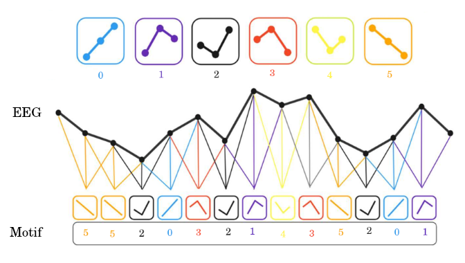

# Motif Functional Connectivity

## Summary

This project aims to reproduce the methodology proposed in the paper **"Decoding Inner Speech with Functional Connectivity"**, which uses motif-based functional connectivity to classify EEG signals associated with inner speech.

The original paper is available at:
https://iopscience.iop.org/article/10.1088/2057-1976/ae451b/meta

For convenience, a local copy of the paper is also included in this repository:
[Decoding Inner Speech with Functional Connectivity (PDF)](./docs/Data_Set_Thinking_Out_Loud.pdf)



---

## Sponsorship

This project was developed through a partnership between the **School of Electrical and Computer Engineering (FEEC)** at **UNICAMP** and **CPQD**.

- **FEEC – UNICAMP:** https://www.fee.unicamp.br/
- **CPQD:** https://www.cpqd.com.br/

---

## Installation

Create the Conda environment:

```bash
conda env create -f environment.yml
```

Activate the environment:

```bash
conda activate motif_env
```